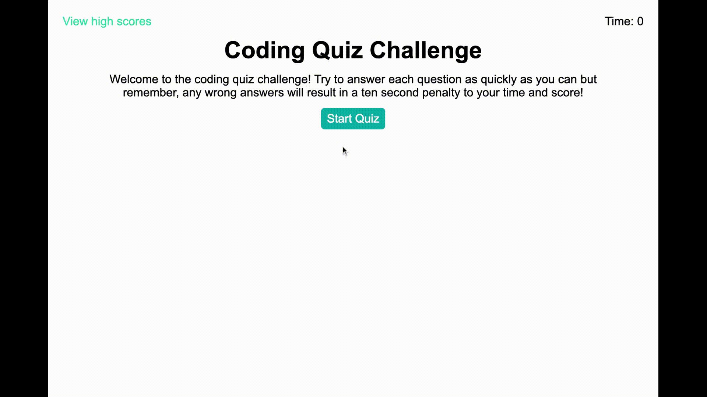

# Code Quiz Challenge

This is a timed, multiple-choice coding quiz that can save high scores.

**User Story**

> AS A coding boot camp student  
> I WANT to take a timed quiz on JavaScript fundamentals that stores high scores  
> SO THAT I can gauge my progress compared to my peers.

**Acceptance Criteria**
> GIVEN I am taking a code quiz:  
> WHEN I click the start button, a timer starts and I am presented with a question  
> WHEN I answer a question, I am presented with another question  
> WHEN I answer a question incorrectly, time is subtracted from the clock  
> WHEN all questions are answered or the timer reaches 0, the game is over
> WHEN the game is over, I can save my initials and score

## Demo

[Coding Quiz Challenge](https://devbritt.github.io/coding-quiz-challenge/)

## Lessons Learned

This project was definitely more of a challenge than any of the others so far. 
My biggest struggle was making sure to account for all the potential bugs, such as when returning to the instructions screen, 
the timer needed to reset and re-displayed to show 0 instead of the end time from the previous playthrough. 
Overcoming those bugs was a matter of trial and error. This project reinforced my ability to come up with creative solutions 
to problems and to be self-sufficient in finding those solutions.
